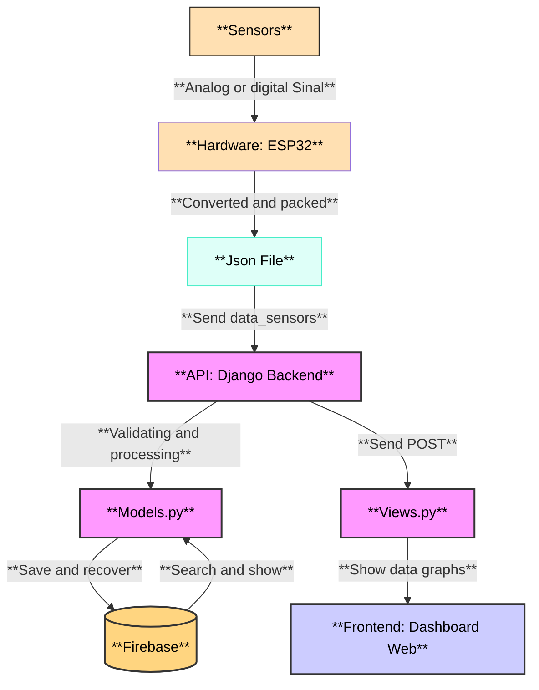

# Sistema de Monitoramento: Telhado Verde Jardim Botânico UFSM

Este repositório contém o código e a documentação do **Sistema de Monitoramento do Telhado Verde do Jardim Botânico da UFSM**. O projeto foi desenvolvido na disciplina de Projeto Integrador em Engenharia de Computação, em parceria com o Grupo de Pesquisas em Modelagem HidroAmbiental e Ecotecnologias da UFSM.

---

## Tecnologias

| Componente | Tecnologias                                                         |
|------------|---------------------------------------------------------------------|
| Backend    | API Python, Firebase|
| Firmware   | C++ (Arduino Core), ESP32                                           |
| Frontend   | HTML5, CSS, JavaScript, Chart.js (para gráficos de histórico)           |
| Sensores   | DS18B20, DHT-11, HCSR04, HL-69 |
| Hardware final | PCB + case |

---

## Visão Geral do Sistema

O sistema é uma solução completa para **coleta, armazenamento e visualização de dados em tempo real**. Ele é dividido em três grandes módulos:

1. **Hardware & Firmware**: Sensores e microcontrolador ESP32 para coleta de dados.

2. **Backend & Cloud**: Uma API em Python para processamento de dados e o Firebase para armazenamento.

3. **Dashboard & Visualização**: Interface de usuário para visualizar os dados de forma clara e intuitiva.

---

## Arquitetura de Software

---
## Funcionalidades
