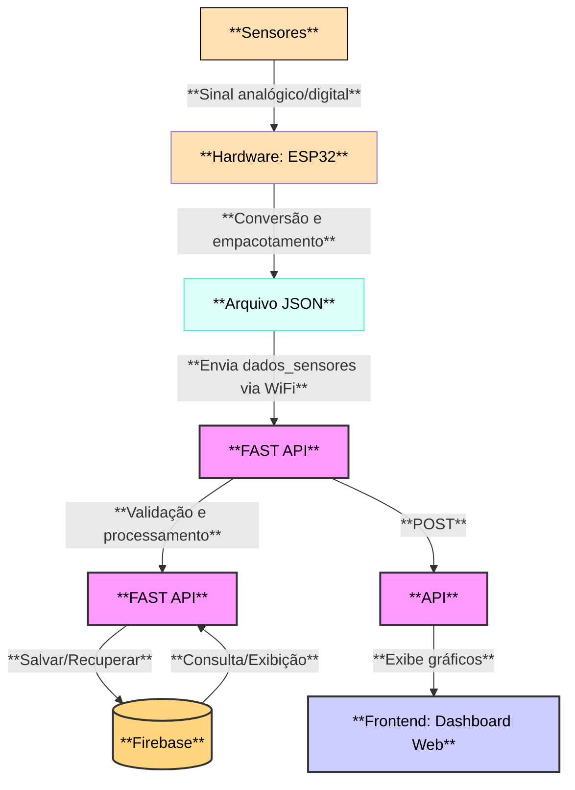

# Sistema de Monitoramento: Telhado Verde — Jardim Botânico UFSM

Este repositório contém o código-fonte e a documentação do Sistema de Monitoramento do Telhado Verde do Jardim Botânico da UFSM. O projeto coleta dados ambientais (solo, ar e chuva) com um ESP32, armazena no Firebase e disponibiliza um backend e dashboard para visualização em tempo real e histórico.

Status: Projeto concluído — código, firmware e scripts de deploy incluídos.

---

## Sumário rápido

- Hardware: ESP32 com sensores (HL-69, DS18B20, DHT11, pluviômetro, HCSR04)
- Firmware: `hardware/main.ino` (Arduino/ESP32)
- Backend: `api-fastapi/` (FastAPI) que envia/recupera dados do Firebase
- Dashboard: `dashboard/` (script Python que exibe visualizações)
- Scripts de deploy: `scripts/deploy_ubuntu.sh` e serviços systemd em `api-fastapi/telhado-api.service` e `dashboard/telhado-dashboard.service`

---


---

## Funcionalidades principais

- Coleta automática de dados do solo e do ar
- Transmissão via WiFi (JSON) para o backend
- Armazenamento histórico em Firebase
- Dashboard com visualização em tempo real e gráficos históricos
- Serviços prontos para executar em servidor Ubuntu (systemd)

---

## Estrutura do repositório

- `api-fastapi/` — Backend em FastAPI (pontos de entrada e integração com Firebase)
  - `api_firebase.py` — aplicação FastAPI
  - `requirements.txt` — dependências do backend
  - `sample.json` — exemplo de payload recebido pelo backend
  - `telhado-api.service` — unit file systemd (deploy)
- `dashboard/` — script/serviço do dashboard
  - `dashboard.py`
  - `requirements.txt`
  - `telhado-dashboard.service` — unit file systemd (deploy)
- `hardware/` — firmware e esquemáticos
  - `main.ino` — firmware ESP32
  - `README.md` — instruções de montagem/flash
- `scripts/` — scripts de suporte e deploy
  - `deploy_ubuntu.sh` — script de deploy para Ubuntu

---

## Arquitetura (visão geral)

---

## Pré-requisitos (desenvolvimento / execução)

- Python 3.8+ e pip
- Virtualenv (recomendado)
- Conta Firebase com service account (JSON) e Firestore/RTDB configurado
- Arduino IDE ou PlatformIO para compilar/instalar `hardware/main.ino`
- Acesso a um servidor Ubuntu (opcional) para executar como serviço systemd

---

## Instruções rápidas — Backend (desenvolvimento)

1. Criar e ativar ambiente virtual (Windows PowerShell):

```powershell
python -m venv .venv; .\.venv\Scripts\Activate.ps1
```

2. Instalar dependências:

```powershell
cd api-fastapi; pip install -r requirements.txt
```

3. Configurar credenciais do Firebase:

- Coloque o arquivo JSON da service account em um local seguro e exporte a variável de ambiente (PowerShell):

```powershell
$env:GOOGLE_APPLICATION_CREDENTIALS = "C:\caminho\para\service-account.json"
```

4. Executar a API (FastAPI / Uvicorn):

```powershell
uvicorn api_firebase:app --reload --host 0.0.0.0 --port 8000
```

Observação: para produção, use o `telhado-api.service` (systemd) e um reverse-proxy (Nginx) — veja `README_DEPLOY.md`.

---

## Instruções rápidas — Dashboard

1. Criar/ativar ambiente virtual e instalar dependências:

```powershell
cd dashboard; python -m venv .venv; .\.venv\Scripts\Activate.ps1; pip install -r requirements.txt
```

2. Executar o dashboard:

```powershell
python dashboard.py
```

Ou configure `telhado-dashboard.service` para executar como serviço no servidor.

---

## Firmware (ESP32)

1. Abra `hardware/main.ino` na Arduino IDE ou PlatformIO.
2. Atualize as credenciais WiFi (SSID/Password) e o endpoint do backend (ou configuração do Firebase) conforme comentários no arquivo.
3. Compile e carregue para a placa ESP32.

Dica: verifique `hardware/README.md` para esquema elétrico, pinagem e recomendações de montagem.

---

## Exemplos de payload

Existe um `api-fastapi/sample.json` com um exemplo de JSON enviado pelo dispositivo. Use-o para testes via curl/postman.

---

## Deploy

Há um guia de deploy rápido em `README_DEPLOY.md` e um script `scripts/deploy_ubuntu.sh` que automatiza a instalação e configuração básica em servidores Ubuntu (criação de venvs, instalação de dependências, configuração de systemd e Nginx). Revise o guia antes de rodar o script em produção.

---

## Contribuição e próximos passos

Se quiser contribuir ou adaptar o sistema:

- Abrir issues descrevendo feature/bug
- Enviar pull requests com branch por feature
- Próximas melhorias possíveis: autenticação na API, painel com múltiplos locais, alertas/thresholds por e-mail/Telegram, testes automatizados e CI/CD

---

## Licença

Este projeto é reservado aos autores e não possui licença aberta de uso ou distribuição.

---

## Créditos e contato

Desenvolvido por alunos de Engenharia de Computação da UFSM em parceria com o Grupo de Pesquisas em Modelagem HidroAmbiental e Ecotecnologias.

Para dúvidas ou colaboração, consulte os autores do projeto (informações de contato internas do grupo/professores).
