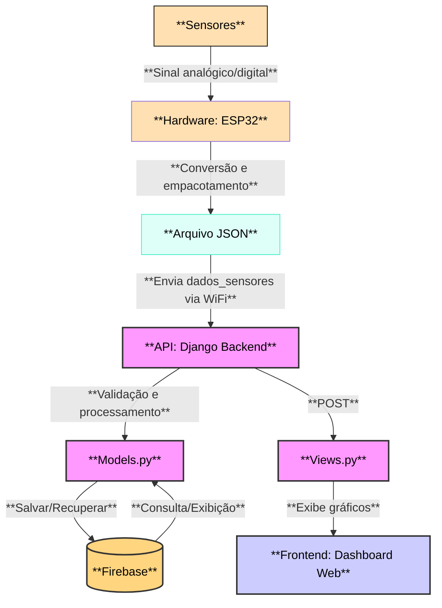

# Sistema de Monitoramento: Telhado Verde Jardim Botânico UFSM

Este repositório reúne o código-fonte e a documentação do **Sistema de Monitoramento do Telhado Verde do Jardim Botânico da UFSM**. O projeto foi desenvolvido na disciplina de Projeto Integrador em Engenharia de Computação, em parceria com o Grupo de Pesquisas em Modelagem HidroAmbiental e Ecotecnologias da UFSM.

---

## Tecnologias Utilizadas

| Componente      | Tecnologias / Componentes                                                                 |
|-----------------|------------------------------------------------------------------------------------------|
| Backend         | Django (Python), API REST, Firebase                                                      |
| Firmware        | C++ (Arduino Core), ESP32                                                                |
| Frontend        | HTML5, CSS, JavaScript, Chart.js (gráficos)                                              |
| Sensores        | HL-69 (umidade do solo), DS18B20 (temp. solo), DHT11 (temp./umidade ar), Pluviômetro, HCSR04 (nível d'água) |
| Hardware final  | ESP32, sensores, PCB, case, alimentação elétrica                                         |

---
## Estrutura do Projeto

- [`/Data Visualization/`](./Data%20Visualization/README.md) — Software: Backend, frontend e dashboard (Django)
- [`/hardware/`](./hardware/README.md) — Hardware: esquemas, sensores e firmware do ESP32

Cada pasta possui um README próprio com instruções e detalhes específicos.

---

## Visão Geral do Sistema

O sistema realiza **coleta, transmissão, armazenamento e visualização de dados ambientais em tempo real**. Ele é composto por três módulos principais:

1. **Hardware & Firmware**: ESP32 e sensores para coleta e envio dos dados ambientais.
2. **Backend & Cloud**: API em Django para processamento e armazenamento dos dados (Firebase).
3. **Dashboard & Visualização**: Interface web para visualização dos dados históricos e em tempo real.

---

## Arquitetura do Sistema

---

## Funcionalidades

- Coleta automática de dados ambientais (solo e ar)
- Envio dos dados via WiFi (JSON) para o backend
- Armazenamento seguro e histórico dos dados (Firebase)
- Visualização em tempo real e gráficos históricos via dashboard web
- Interface administrativa para gerenciamento do sistema
- Modularidade para inclusão de novos sensores ou funcionalidades

---

## Sensores Utilizados

- **HL-69** — Umidade do solo
- **DS18B20** — Temperatura do solo
- **DHT11** — Temperatura e umidade do ar
- **Pluviômetro** — Captação de chuva
- **HCSR04** — Sensor ultrassônico para nível d'água nos reservatórios

---

## Licença

Este projeto é reservado aos autores e não possui licença aberta de uso ou distribuição.

---

## Créditos e Contato

Desenvolvido por alunos de Engenharia de Computação da UFSM, em parceria com o Grupo de Pesquisas em Modelagem HidroAmbiental e Ecotecnologias.

Dúvidas ou interesse em colaboração? Entre em contato com os autores do projeto.

---
